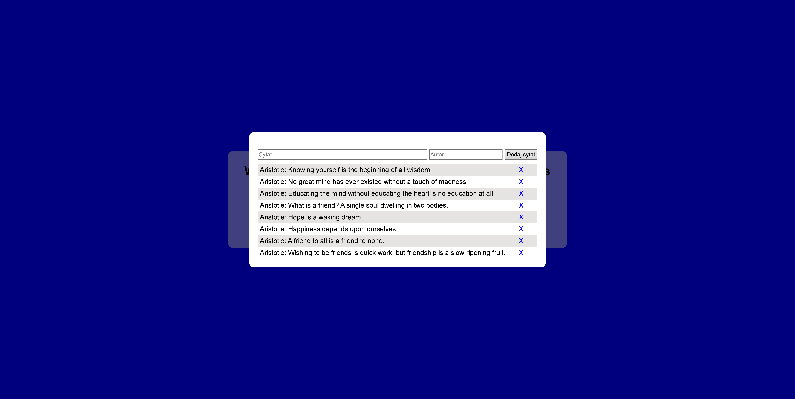
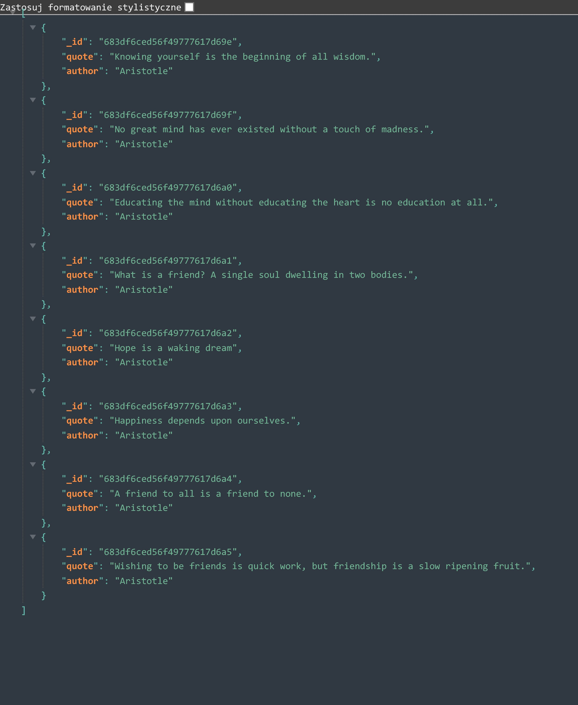
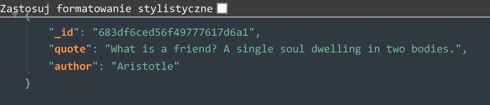

# 🧠 Aristotle Quotes App

A minimal quote-serving application built with **Node.js** and **MongoDB** — without using Express or any major frameworks. Displays random quotes by Aristotle, includes a quote manager editor, and serves static HTML/CSS/JS.

---

## 📁 Project Structure

```
quotes_app/
│
├── controllers/
│   └── quoteController.js         # Business logic for quote operations
│
├── data/
│   └── mongoDbSingleton.js        # Singleton for MongoDB connection
│
├── model/
│   └── quoteModel.js              # Quote schema and DB functions
│
├── static/
│   ├── index.html                 # UI for random quote display
│   ├── style.css                  # Styling
│   ├── app.js                     # Frontend logic for quote rotation
│   └── editor.js                  # Frontend for managing quotes
│
├── util/
│   └── staticServer.js            # Static file server for serving UI
│
├── server.js                      # Main Node.js server with routing
├── package.json
└── package-lock.json
```

---

## 🚀 Getting Started

### ✅ Requirements

- Node.js (v16 or newer)
- MongoDB running locally (`mongodb://127.0.0.1:27017`)

### 📦 Installation

1. Clone the repository:

```bash
git clone https://github.com/Jaroslaw-Baumgart/quotes_app
cd quotes_app
```

2. Install dependencies:

```bash
npm install
```

3. Start MongoDB (if not already running):

```bash
mongod
```

4. Run the app:

```bash
node server.js
```

5. Visit the app in your browser:

```
http://localhost:8080
```

---

## 📡 API Endpoints

| Method | Endpoint                | Description                        |
|--------|-------------------------|------------------------------------|
| GET    | `/api/quotes`           | Get all quotes                     |
| GET    | `/api/quotes/random`    | Get a random quote                 |
| GET    | `/api/quotes/:id`       | Get a specific quote by ID         |


---

## 🖼️ UI Features

- 🔀 Press **Space** to get a new random quote
- ✏️ Press **E** to open the quote manager
- ➕ Add a new quote
- ❌ Delete quotes with one click

---

## 📸 Screenshots







---

## ⚠️ Known Issues

- Basic input validation only

---

## 🧠 Quote Schema (MongoDB)

```js
{
  _id: ObjectId,
  text: String,
  author: String
}
```

---

## 📌 Features

- 🧠 Simple quote model using MongoDB
- 🔃 Random quote API logic
- 📜 Static HTML interface
- 🔧 Minimal, no-framework backend
- 🧹 Easy-to-extend architecture

---

## 💡 Possible Improvements

- Add frontend validation for quote inputs
- Use PUT/DELETE methods instead of POST for update/delete
- Add search or filter by author/topic
- Improve error handling and response codes

---

## 👨‍💻 Author

Created by **Jarosław Baumgart**

## 📜 License

This project is available under the **MIT License**

## 📬 Contact

🔗 **GitHub:** [Jaroslaw-Baumgart](https://github.com/Jaroslaw-Baumgart)  
📧 **Email:** jaroslawbaumgart@gmail.com
